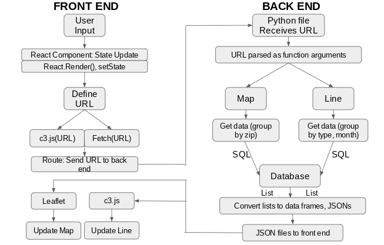
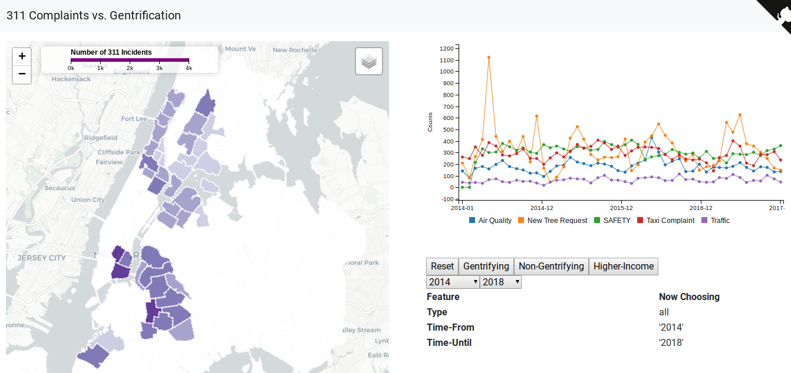
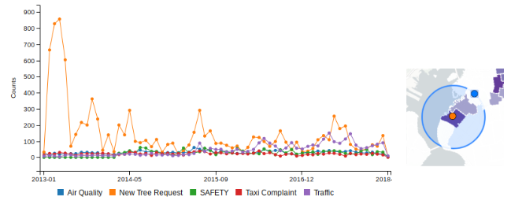
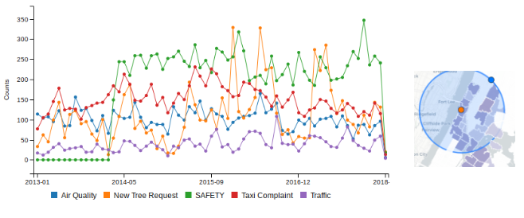
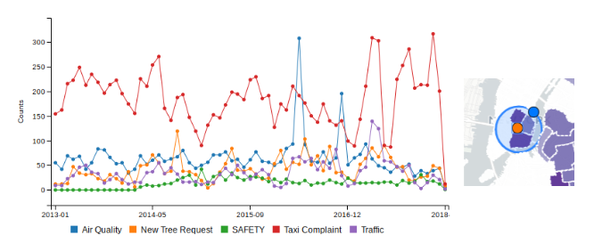

# Exploring 311 Complaints through the Lens of Gentrification in New York City
## by Y. Wan, L. Zhang, E.Hansen
### for Data Visualization, NYU CUSP, Spring 2018

`Python` `Flask` `ReactJS` `LeafLet` `C3.JS` `D3.JS` `PostgreSQL` `AWS` `Heroku`

# I. Introduction
While gentrification is not an especially new phenomenon, the concept has taken over many of the residential areas of New York City. A report in 2016 by New York University’s Furman Center for Real Estate and Urban Policy reveals the widespread effects of gentrification across the Big Apple. Since 1990, nearly 30% of New York Cities have begun to gentrify, defined as the shift in low-income neighborhoods that experienced an increase in average rent prices above the median value by 2010-2014. Only a handful  of neighborhoods - just seven - are considered to not be gentrifying, while the remaining neighborhoods out of the 55 considered in the study are labeled as “high income” and thus already gentrified [1][2]. 

	Clearly, New York City is becoming an urban environment geared towards those highest-earning among us. Population drift, in terms of demographics, density, and escalating rent burdens, reveals a dynamic and complex tangle of cultural and behavioral responses - from modes of transportation to which grocery stores choose to open where. Public services may similarly see patterns of use changing over time as a direct result of the gentrification effects in New York City. In this study, the 311 service calls and complaints available since 2013 are analyzed in the context of these clusters of gentrifying, high income, and non-gentrifying regions of the city in order to determine if there is a trend to be observed in the most frequently called-about 311 categories. Specifically, as regions begin to gentrify across the city, can we observe a distinct change in calls concerning complaints air quality, safety, or traffic? In addition, we consider the use of public services, such as taxi usage through calls concerning taxi complaints, and services indicative of transfer of property ownership or aesthetic development of a region through Parks Department new tree requests. 

Knowing the shift in behavioral patterns in 311 calls across regions of New York City is import in particular due to the inherent revelation of a population’s changing priorities. Knowing what a population is perceiving as more or less important over time in the context of gentrification-based population shift is valuable, for example, for real estate developers, consulting agencies, and urban intelligence teams. To illustrate, a real estate consulting agency has a client that would like to know whether their neighborhood is gentrifying; from their resulting list of gentrifying and non-gentrifying zip codes, they would like to determine the changing priorities of the population through 311 complaints, if they exist, to see if they should consult their clients to focus on services geared to assuaging developing neighborhood fears and complaints or instead focus on the enrichment of aesthetics and public services. They already know that construction-based complaints, such as construction site noise, are common in gentrifying areas, but they would like to know if other more subtle factors reflect behavioral patterns that may give them a predictive edge. The visualization accompanying this report aims to do just that by allowing users to view trends in the numbers of 311 complaints overall in New York City alongside 311 behavioral trends specific to clusters of gentrifying, non-gentrifying, and high income zip codes. 

 

 
 # II. Data and Task Abstraction
 ## Data

The primary data source used in this project is New York City Open Data’s collection of 311 service calls [3]. These data span over seven years of service calls, from January of 2013 through April 2018, and were available on an Amazon Web Services server to be accessed via API. Each row in the data is a single instance of event data, e.g. a particular call to 311 services. Each event contains a complaint type, date and time the call was recorded, the latitude and longitude of the event, and the month during which the event occurred. The complaints and calls are broadly categorized into five major types: taxi complaints, safety, air quality, new tree requests, and traffic. Each of these categories is an accumulation of all sub-categories related to the category, e.g. all types of taxi driver behaviors or accidents are grouped within the Taxi Complaint category.

In order to geographically visualize these data, a GeoJSON file of New York City zip codes was also acquired from New York City Open Data. Additionally, a list of sub-borough areas in New York City classified as gentrifying, non-gentrifying, or higher-income was obtained by the New York University Fruman Center.
  
 ## Actions, Targets, and Encodings
  
  Actions in this visualization aim to help the user consume information through presentation and discovery by allowing a user to verify a given hypothesis they may have concerning the data sources. For discovery-based analysis, the outcome is to use the visualization to generate or confirm a hypothesis. In this case, the user will be able to observe and verify any trends in 311 service calls in a way that has not been considered previously: in the context of clusters of gentrification across zip codes. The goal of presentation is to communicate something specific and already understood by the audience, which in this case is the clustering of zip codes from the gentrification reports. The visualization can also feature the enjoy goal due to its pooling of information about New York City in a geographic and temporal way. As much as the visualization can be designed for clients to get specific information they need from it, the visualization could very well be appealing to other populations that find the information interesting and amusing to discover.

Searching for elements of interest requires the lookup search type because the users already know what they are looking for in the data and where to find it in terms of geography. Temporally, however, the data are more flexible; the date range can be specified based on user preference, indicating the browse search type. For querying, a user can identify the 311 service calls for a single zip code or cluster of zip codes and summarize the results across all zip codes to determine their overall impact.

Targets in this visualization include trends in time series data and features or structures of interest, such as the clusters of gentrification status. Time-based attributes displayed in the visualization are dependent on geographic regions selected. The data from the database are counted per service call type and the results encoded as color across the map of NYC. Parts of the map may then be navigated and different parts selected to view the counts per service type per region as a time series.
  
## Design Choice Justifications

For a simulated real estate consulting agency client, it is important to understand their neighborhoods or regions of interest not simply geographically, but also temporally. An interactive map of New York City was selected to address the geographic component of the client needs because neighborhoods can easily be seen and analyzed in the context of surrounding neighborhoods, whether through gentrification cluster labeling or by selecting groups of neighborhoods manually. In order to make informed decisions about a region, whether or not it is undergoing gentrification, it is necessary to evaluate trends over time of different 311 calls and not simply snapshots of overall counts. For this reason, the visualization generates a time series specific to the geographic and temporal specifications of the user. This time series is displayed and updated alongside the map so that understanding and comparison is holistic. 

More under-the-hood, gentrification-associated clustering of neighborhoods can be toggled easily filter the visualization to user interests. Selection radii are intuitive ways to more arbitrarily explore regions in space on top of the initial query. Clarity is enhanced in the time series plots by permitting both the ability to highlight a single 311 category plotted in a multi-line time series or instead selecting to display only a single category.
  
 # III. Visualization Methods
 
 
  
  Figure 1: Flow chart of front- and back-end development pipeline

  

The process of deploying a web-based interactive visualization is accomplished through the utilization of a combination of Flask, react.js, Leaflet, c3.js, and D3.js (responsible for handling the GeoJSON zip code file). The technical details of the visualization can be generalized into three main steps visualized in Figure 1: 

1. Receiving and processing user input on the front end;  
2. Querying the database on the back end to return data;  
3. Rendering these data on the front end. 
  

Step one begins when the user interacts with the web visualization. User interaction is handled by react.js. Perhaps he selects a particular date range to display the data or toggles one of the three buttons to display data for a particular gentrification-related cluster of NYC zip codes. Upon user input, react.js responds to what it interprets as a state update - that is, the visualization needs to be updated to reflect the user input. React then has a function that begins to set the state by defining an interaction-based URL. User interaction is interpreted as a URL by the front end specifying the data required in order to update the map to display the correct request from the user (for example, ‘/api/1/zip/type/month/…). From here, c3.js and Leaflet receive the generated URL as an argument to internal functions, which are then run. The URL is then routed to the back end. If the user chooses to reset the map to its default appearance by clicking the “Reset” button, the routing function uses a built-in default URL instead to send to the back end.

Step two begins with the back end receiving the generated URL from functions on the front end. A python file handles database querying and generation of data for rendering on the front end through an API and a URL processing function. The URL is passed through two different processes, resulting in two different SQL queries to the database, to update each of the front end’s map and time series visualizations. To obtain new map visualization data, the URL is parsed into arguments in a function that will return a SQL query that groups 311 service calls by zip code and count. This SQL query is sent to a PostgreSQL database on Amazon Web Services that returns the queried data in a list. The process is similar to obtain new time series visualization data as a second list, the exception being that data are grouped by type and month in the query. The two lists are converted into Python pandas dataframes, which are then converted into JSON files. 

The JSON files are then sent to the front end for the final step in the visualization pipeline. The c3.js and Leaflet fetching functions used in step one return to handle the JSONs received by each. Once the JSON files are received, the requested components are interpreted as updated; knowing that the components requested did update, a function to update the web visualization by rendering each of the map and the time series plots with the new set of data for each is called.

Additional functionality of the map includes being able to point and click to define a centroid of a selection circle, the radius of which can be expanded arbitrarily. All data, processed as above, within the selection circle’s radius is then displayed without updating the overall appearance of the map. 

# IV. Outcome and Evaluation

Our simulated client, a real estate consulting agency, itself has a client that would like to know if there are any shifts in trends from more nuanced sources than what might obviously be related to gentrification. The visualization tool developed in this project makes this evaluation possible by allowing its user to select different regions of New York City clustered by gentrification status and observing trends in 311 service complaints concerning public services, scene aesthetics, transportation, and possible changing sentiment concerning safety in demographically dynamic zip codes.

To start, this development-focused client is looking at what it might be able to do to help its resident satisfaction and attract more residents to the area. We first look to see where the gentrifying regions are and the overall trends in 311 calls for gentrified regions (Figure 2):

  
  
  Figure 2: Collection of  “Gentrifying” neighborhoods and associated 311 call trends

Notably, we see a very obvious seasonal and decreasing trend in New Tree Requests for this region. While there are perhaps modest increasing or decreasing trends in the other categories, there is not a distinct trend overall to categorize all gentrifying zip codes regarding them. This, however, allows the visualization to truly shine: it is possible to geographically isolate regions of gentrification to observe if there are more local community-specific priorities that are not revealed by simply calling an area “gentrified.” To illustrate, let us observe the trends between gentrified communities across different parts of Manhattan and Brooklyn.

  
 
  Figure 3: Western Brooklyn  “Gentrifying” neighborhoods and associated 311 call trends

In Western Brooklyn, the initial demand for new tree plantings on city streets by the Parks Department is even more pronounced (Figure 3). As the demand for new tree plantings decreases over time, we notice that complaints about traffic see a sizeable increase in this region - perhaps neighborhood aesthetic renovation has drawn many people to the area, but now there are too many cars. Our client could then decide to look into street parking allocation and parking garage information for this area. Our client may also look to an increasing trend in traffic complaints to see whether it is predictive of population or rent stabilization. 

 
  

  Figure 4: Northern Manhattan “Gentrifying” neighborhoods and associated 311 call trends

In Northern Manhattan (Figure 4), we see a much different picture. First, tree requests follow no decreasing trend; in fact, there is still ample demand for trees in this region, apparently, indicating that perhaps this region is still in the early stages of gentrification. Here, however, safety is the community’s greatest priority as far as they regard 311 service calls. 

  
   
  
  Figure 5: Lower Manhattan “Gentrifying” neighborhoods and associated 311 call trends

In Lower Manhattan (Figure 5), we see relative abundances in 311 calls concerning air quality and taxi complaints. Being lower Manhattan, this is perhaps not so surprising, but we notably see an increase in requests in both traffic and in safety, the latter much more so in the most recent 6-12 months. 

Overall, the visualization allows our simulated client to not only understand the unique priorities of neighborhoods undergoing dynamic change, such as gentrifying regions, but it also allows our client to detect changes in these priorities and where correlated priorities might exist. It is not sufficient to label a region as “gentrifying” or “not gentrifying” and looking at overall trends for a client hoping to specialize in the needs of a particular region. While this analysis is restricted to gentrifying communities, the same analysis can be done should the client wish to focus on regions that have not or have already gentrified. Our simulated client can take these results and compare them with neighboring communities with different labels (such as not gentrified or already gentrified) and get a much more comprehensive picture of where, in rapidly gentrifying New York City, certain communities are in this timeline and predict what their next changing needs might be so that they may be addressed as early as possible. 

In the future, it would be useful to modify the visualization for ease of visual comparison by, after selecting a cluster from the menu to display, also displaying smaller plots of time series data for the other two clusters alongside the primary time series. More generally, the functionality could allow a user to instead keep a record of multiple plots (such as a single region in multiple time periods, or a regional plot with several individual constituent neighborhood plots) in the field of view. This would allow the user to dynamically explore and compare trends over time or augment any mental priors about the data.

# V. References and Sources

[1] Florida, R. (2016, May 12). Where New York Is Gentrifying and Where It Isn’t. Retrieved
 from www.citylab.com.
  
[2] The Furman Center at New York University (2015). Focus on Gentrification. Website: 
http://furmancenter.org.
 
[3] New York City Open Data Portal. 311 Service Requests from 2010 to Present.
Retrieved from https://nycopendata.socrata.com/

  

    
